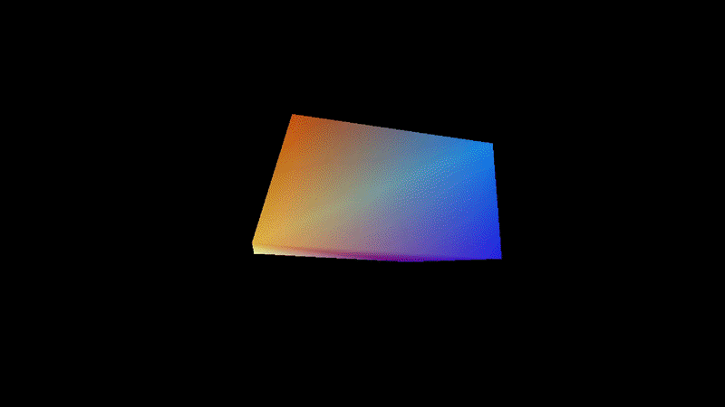

# ANSI Renderer

ANSI Renderer is a GPU-accelerated terminal video renderer built with PyTorch + Triton.
It renders RGB frames as ANSI escape sequences and streams them directly to your terminal.
In practice, it can handle 720p-equivalent output and 1080p vertical content (hardware and terminal dependent).

Current render modes in this repo:
- `pixel`
- `quadrant`

Notes:
- This project currently targets CUDA/NVIDIA workflows.

## Demos

- [](https://youtu.be/7Zr2gqd8iPI)
- Yaosobi - Idol: https://youtu.be/7995X3B275g
- 3D Cube: https://youtu.be/7Zr2gqd8iPI
- Bad Apple: https://youtu.be/EVdXZdDUfWs

## Requirements

- Python `>=3.13`
- NVIDIA GPU + CUDA-capable PyTorch build
- A fast terminal emulator (Alacritty/Kitty/WezTerm recommended)
- FFmpeg tools available in `PATH`:
  - `ffmpeg`
  - `ffprobe`
  - `ffplay`

### Alacritty preset (720p, quadrant, divisor 2)

Use this in your Alacritty config for a fullscreen, borderless setup tuned for 720p with `render_mode="quadrant"` and `quadrant_cell_divisor=2`:

```toml
[font]
size = 3.7

[font.offset]
x = 0
y = -5

[window]
startup_mode = "Fullscreen"
padding = { x = 0, y = 0 }
```

## Installation

1) Create and activate a virtual environment

```bash
python -m venv .venv
source .venv/bin/activate
```

2) Install a CUDA-enabled PyTorch build (pick your CUDA version)

```bash
# example (CUDA 12.8)
pip install torch --index-url https://download.pytorch.org/whl/cu128
```

3) Install project dependencies

```bash
pip install -e .
```

## Run

### Video demo (`example.py`)

Edit `video_path` in `example.py`, then run:

```bash
python example.py
```

This script:
- decodes frames with OpenCV/FFmpeg
- plays audio with `ffplay`
- uses `AnsiRenderer` with adaptive quality controls

### 3D cube demo (`example/object.py`)

```bash
python example/object.py
```

This is a procedural GPU-rendered cube scene streamed to ANSI.

### Timing analysis

If you enable timing in config (for example in `example/object.py`), analyze the CSV with:

```bash
python analyze_timing.py timing_object.csv 1
```

## Minimal API usage

```python
import torch
from src.ansi_renderer import AnsiRenderer
from src.config import Config

def frame_generator():
    while True:
        # H x W x 3, uint8, device should match config.device
        yield torch.zeros((720, 1280, 3), dtype=torch.uint8, device=torch.device("cuda"))

cfg = Config(width=1280, height=720, device=torch.device("cuda"), render_mode="pixel")
renderer = AnsiRenderer(frame_generator(), cfg)

for ansi, frame_idx in renderer.get_next_ansi_sequence():
    renderer.render_frame(ansi, frame_idx)
```

## Project layout

- `src/ansi_renderer.py`: render loop, pacing, buffering, output writing
- `src/frame_processing.py`: resize, diffing, and mode-specific preprocessing
- `src/ansi_generator.py`: Triton kernels and ANSI sequence generation
- `src/config.py`: runtime configuration and ANSI constants
- `example.py`: video playback demo
- `example/object.py`: procedural cube demo
